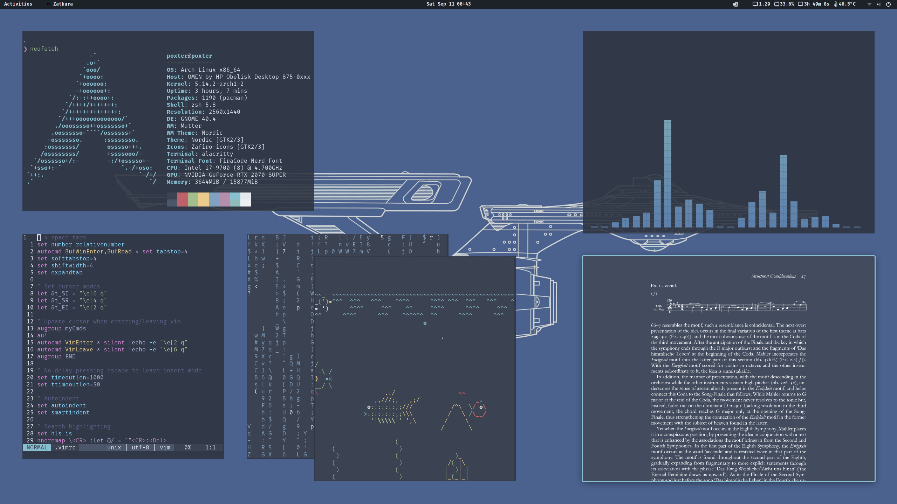

# GeneralPoxter's dotfiles

    

## Additional installations
* GNOME Nordic theme ([repo](https://github.com/EliverLara/Nordic))
* Pop Shell ([repo](https://github.com/pop-os/shell))
* Vitals ([repo](https://github.com/corecoding/Vitals))
* Zafiro icons ([repo](https://github.com/zayronxio/Zafiro-icons))
* Oh My Zsh ([repo](https://github.com/ohmyzsh/ohmyzsh))